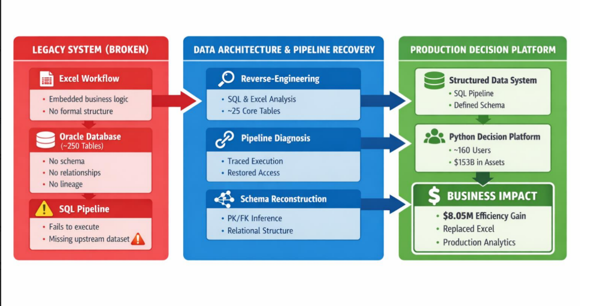
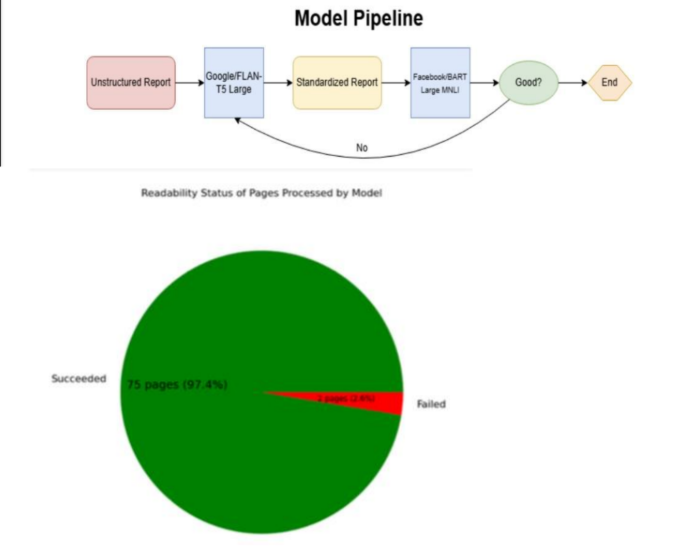
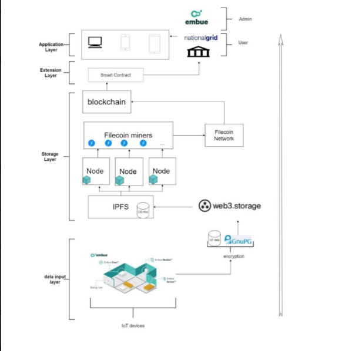
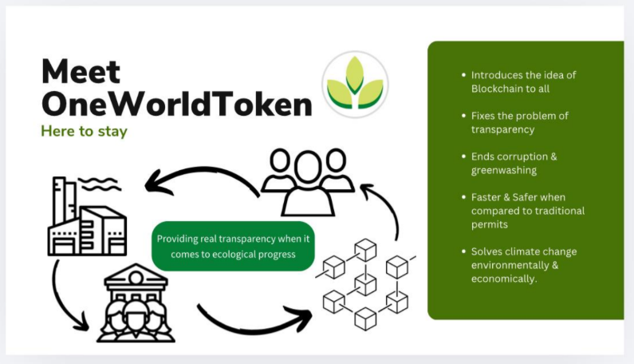
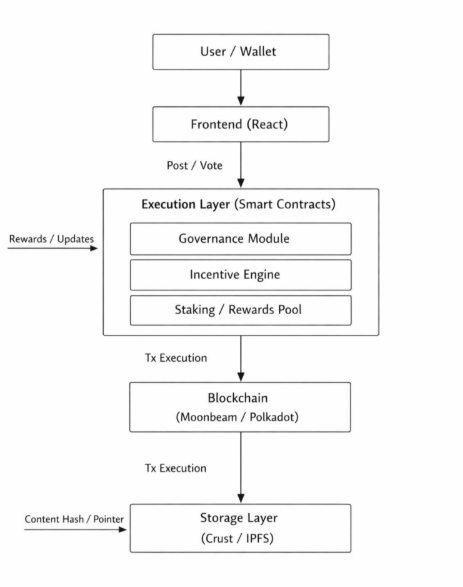

# Cameron Morreale — Data Engineering Portfolio

**Reverse-engineering broken, ambiguous data systems into reliable decision infrastructure.**

Data Engineer specializing in financial data systems, data architecture, and pipeline reconstruction—translating fragmented business logic and undocumented workflows into structured, auditable systems that support real decision-making.

---

---

**MS Data Science — Worcester Polytechnic Institute**
**Wellington Management — Data Engineering / Data Architecture**

📎 [LinkedIn](https://www.linkedin.com/in/cam-morreale99)

---

## 🧠 Core Focus

* Data Architecture & Schema Reconstruction
* SQL Pipeline Debugging & Recovery
* Unstructured Data → Structured Analytics Pipelines
* Financial Data Systems & Investment Workflows
* End-to-End Data → Decision Infrastructure

---

## 🔥 Professional Work

### 🚀 Wellington Management — Data Architecture & Pipeline Recovery

  

**Reconstructed the data architecture behind a $153B investment decision platform used by ~160 investment professionals.**

### Problem

A legacy Excel-driven investment workflow was being migrated into a production Python platform, but the underlying Oracle environment contained ~250 tables with no schema, no documented relationships, and no clear lineage. The SQL pipeline failed before the system could execute, indicating a deeper architectural dependency issue.

### Intervention

Reverse-engineered SQL logic alongside embedded Excel business rules to reconstruct the system’s implicit data model. Narrowed the environment to ~25 core tables, inferred relationships through dependency tracing, and followed execution paths to identify a missing upstream dataset. Restored access and re-enabled end-to-end pipeline execution.

### Impact

* Restored pipeline execution without redesigning the system
* Enabled continuation of the production decision platform build
* Supported ~160 investment professionals across ~$153B in assets
* Contributed to a platform associated with ~$8M in annual operational efficiency gains

📄 [Full Technical Writeup](./wellington/technical-writeup.md)

---

### 📊 MassDEP — Document Intelligence & Analytics System

  

**Unstructured Environmental Reports → Validated Data → Power BI Analytics**

### Problem

Environmental construction reports contained critical data such as PFAS metrics and shipment quantities embedded in inconsistent free-text formats. Manual extraction required document-by-document interpretation, limiting scalability and introducing inconsistencies in reporting.

### System Built

Architected a multi-stage pipeline converting unstructured documents into structured datasets. Implemented semantic retrieval, structured extraction, and validation layers combining rule-based checks, contextual disambiguation, and post-generation verification to ensure outputs were grounded and reliable.

### Analytics Layer

Integrated outputs into Power BI dashboards to enable stakeholder interaction with processed data. Designed page-level inspection, readability tracking, and system performance visualization to improve transparency and usability.

### Impact

* Achieved ~97.4% document processing coverage
* Reduced manual reporting effort by an estimated ~40%
* Enabled scalable analysis across previously unstructured datasets

📄 [Technical Writeup](./massdep/technical-writeup.md)

---

### 🔗 Embue — Distributed IoT Data Infrastructure (Industry Project)

  

**Secure, Verifiable Data Pipelines Using Decentralized Infrastructure**

### Problem

Centralized IoT storage created single points of failure and weak guarantees around data integrity, auditability, and tamper resistance.

### System Built

Designed a layered architecture separating encryption, storage, verification, and access control. Data was encrypted at ingestion, stored via IPFS, and verified through Filecoin/blockchain infrastructure, ensuring integrity without sacrificing scalability.

### Impact

* Established tamper-resistant, verifiable data pipelines
* Enabled scalable storage with independent integrity guarantees
* Created clear separation between storage and verification layers

📄 [Co-Authored Paper](./research/decentralized-iot-architecture.pdf.pdf)
📁 [Project Folder](./embue/)

---

## ⚙️ Projects

### 🎲 BoardGameGeek — Data Platform

  

**Async Data Pipeline + Relational Modeling for Marketplace & Ratings Data**

### Problem

Marketplace prices, ratings, and metadata were distributed across heterogeneous APIs with rate limits and inconsistent formats.

### System Built

Developed an async ingestion pipeline with bounded concurrency, retry logic, and rate-limit handling. Designed preprocessing workflows for cleaning, normalization, and validation, and built a recursive relational schema for entity relationships.

### Impact

* Produced structured, queryable datasets
* Enabled integration between backend pipelines and frontend workflows

📄 [Technical Writeup](./bgg/technical-writeup.md)

---

### 🌍 OneWorld — Carbon Market Infrastructure (Top 3 / 100+ Teams)

  

### System

Designed a tokenized emissions system where permits function as programmable financial assets with deterministic supply decay, time constraints, and tiered pricing.

### Impact

* Top 3 out of 100+ teams
* Translated policy constraints into enforceable infrastructure
* Embedded auditability and incentive alignment into system design

📁 [Project Folder](./oneworld/)
📄 [Technical Writeup](./oneworld/technical-writeup.md)

---

### 🧩 Oasis — Decentralized Social Platform (1st / 100+ Teams)

  

### System

Built a decentralized platform using DAO governance, staking mechanisms, and token-based rewards to align user incentives with platform behavior.

### Impact

* 1st place out of 100+ teams
* Delivered full system architecture under 48-hour constraints

📁 [Project Folder](./oasis/)

---

## 🧠 How I Work

* Ambiguous workflow → structured system
* Business logic → data model
* Broken pipeline → diagnosed dependency → restored execution
* Raw data → validated datasets → usable analytics
* Experimental system → controlled, auditable workflow

---

## 🎯 Career Focus

Targeting roles in:

* Technical Business Analyst (Data Systems)
* Data Engineering (Finance / Asset Management)
* Analytics Engineering / Data Platforms
* Financial Data Systems & Decision Infrastructure

---

## 🔗 Links

* [LinkedIn](https://www.linkedin.com/in/cam-morreale99)
* [Wellington Technical Writeup](./wellington/technical-writeup.md)
* [MassDEP Technical Writeup](./massdep/technical-writeup.md)
* [Embue Paper](./research/decentralized-iot-architecture.pdf.pdf)
* [OneWorld Project](./oneworld/)
* [BoardGameGeek Project](./bgg/)
* [Oasis Project](./oasis/)

